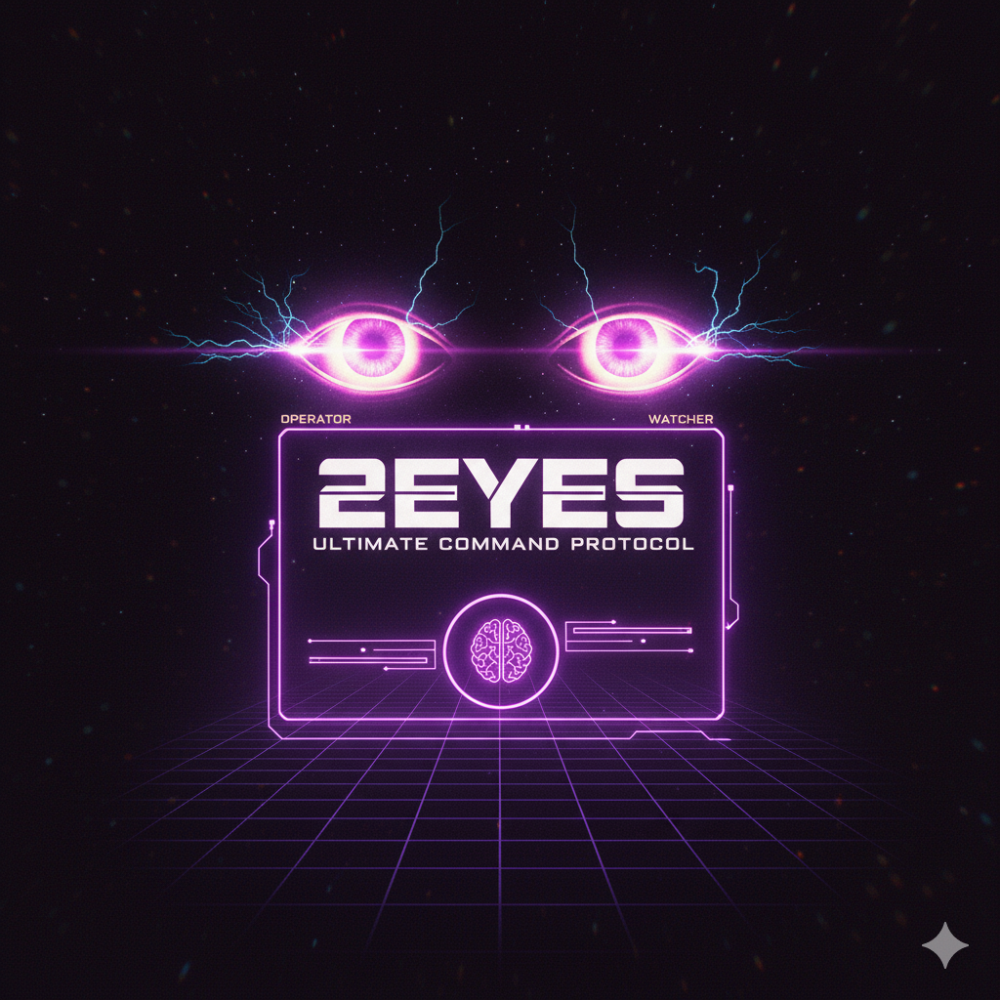
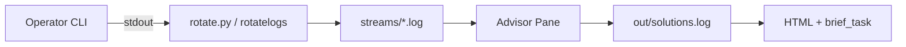
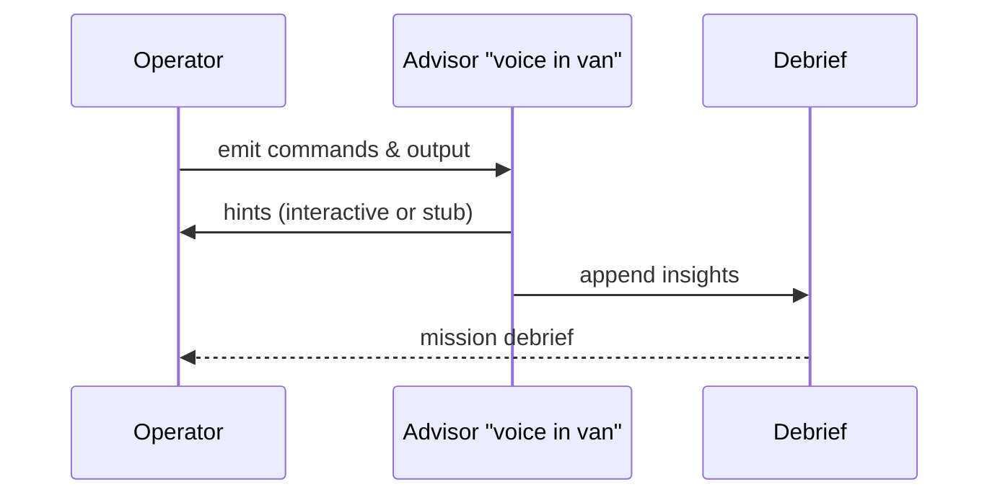

# 2eyes Toolkit



2eyes turns your tmux session into a “voice-in-the-van” experience: one pane for the operator (you), one pane that keeps watch over the log stream, and an advisor pane where a second set of eyes—human, Codex, or both—can follow along. The current setup mirrors an operator with a remote support agent; the long-term vision adds a third, optional “god-eye” that can take the controls (via `tmux send-keys`) when explicitly allowed.

The repository ships with:

- `pair_stream.sh` — orchestrates the tmux layout, rotates logs, and bootstraps the advisor pane.
- `rotate.py` — Python fallback that mirrors Apache `rotatelogs` naming and retention.
- `run.sh` — menu-driven command center for creating workspaces, running tests, and launching advisor sessions.
- `tests/run_tests.sh` — headless regression sweep that mirrors the manual walkthrough.
- `tools/debrief.sh` — turns a finished workspace into an HTML/Markdown mission report scaffold.
- Manuals (`manual.md`) and `SPEC_explanation.md` describing the stream format and validation steps.
- Sample casts (`casts/*.cast`) you can replay or feed to Codex for simulated missions.

## Architecture at a Glance





## Implemented

- **Operator + watcher + advisor panels:** default tmux layout provides `CLI Panel`, `Streams Panel`, and (in advanced mode) `Advisor Panel`, each named so you always know their role.
- **Backend parity:** the Python rotating backend keeps canonical filenames and respects keep/interval semantics.
- **Workspace orchestration:** `run.sh` creates numbered workspaces (`workspace_001`, `workspace_002`, …), reacts to existing tmux sessions, and records metadata for later attachment or teardown.
- **Advisor flexibility:** choose between an interactive shell, the built-in regex stub, or an arbitrary Codex CLI command (e.g. `codex exec -m gpt-5-codex-medium …`).
- **Automation ready:** `tests/run_tests.sh` exercises basic/split/advanced modes, validates rotation retention, and confirms Codex stub logging—all with `--no-attach` sessions so CI or headless terminals can run it.

## Not Yet / Roadmap

- **Advisor evolution:** richer Codex prompts, multi-turn hints, and eventually the optional “god-eye” that can `tmux send-keys` into the operator pane when invited.
- **Self-installing dependencies:** today we assume `tmux`, `python3`, and optionally `rotatelogs` are present.
- **Cross-platform support:** currently validated on Linux; Windows/WSL paths may need adjustments.
- **CI wiring:** no GitHub Actions yet; contributions welcome.

## Getting Started

```bash
git clone git@github.com:taituo/2eyes.git
cd 2eyes
./run.sh
```

The menu offers:

1. Start advanced workspace (interactive advisor)
2. Start advanced workspace (Codex stub)
3. Start advanced workspace (custom Codex command)
4. Run automated regression suite
5. Attach to existing workspace
6. Stop & remove workspace
7. List workspace status
8. Exit

Need Codex running automatically? Pick option 3 and paste something like:

```
codex exec --cd "$PWD/workspaces/workspace_001" \
  --dangerously-bypass-approvals-and-sandbox \
  -m gpt-5-codex-medium \
  'Track the operator log, summarise errors, and propose next actions.'
```

Prefer manual steering? Option 1 opens the advisor pane as a shell so you can chat with Codex or run helper scripts yourself. Option 2 reverts to the regex stub that flags common CLI issues.

### Automated Checks

Use the regression sweep to mirror the manual walkthrough:

```bash
./tests/run_tests.sh
# or reuse a workspace
./tests/run_tests.sh --workspace workspaces/workspace_099
```

Artifacts (streams, out, scripts, and `test_report.txt`) stay inside the chosen workspace. Sessions are left detached so the tests can run inside CI.

## Mission Briefings & Reports

Every workspace collects its own log stream (`streams/stream-*.log`), advisor output (`out/solutions.log`), and metadata (`.workspace`). Run `tools/debrief.sh --workspace workspaces/workspace_001` to generate:

- `debrief.html` — self-contained report with Mermaid diagrams and recent evidence
- `brief_task.md` — ready-to-use Codex prompt scaffold for a one-shot debrief

Bring in the sample casts for richer playback or hand them to Codex for after-action analysis.

## Contributing

1. Fork the repo, branch off `master`, and keep `run.sh`, `tests/run_tests.sh`, and `tools/debrief.sh` green.
2. When touching the spec or layout, update `manual.md` plus the regression tests.
3. Run `./tests/run_tests.sh` (optionally with `--workspace …`) before opening a PR.
4. In your PR summary, call out improvements towards the advisor/god-eye roadmap (semi-automatic hints, trusted takeover, richer debriefs).
